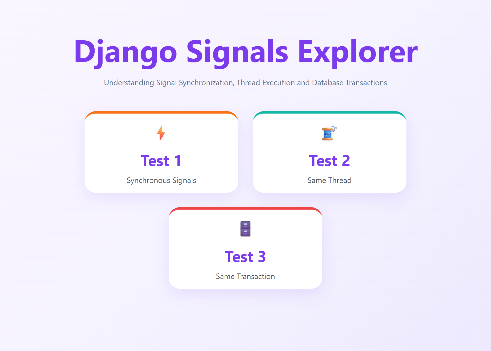
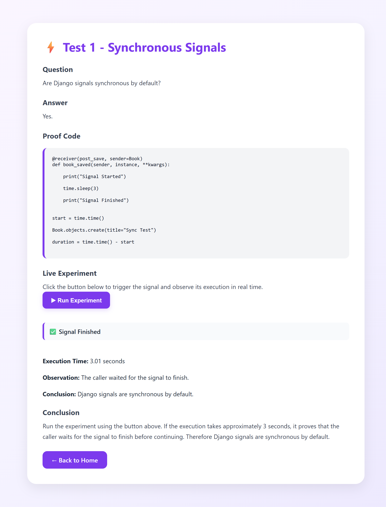
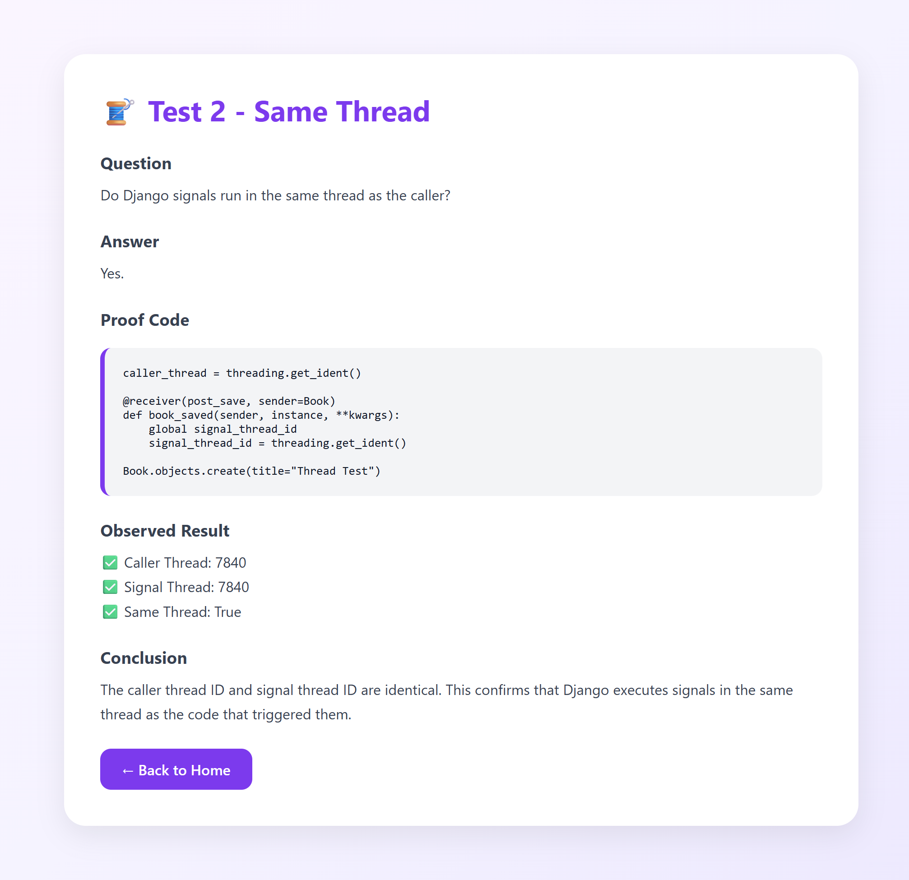
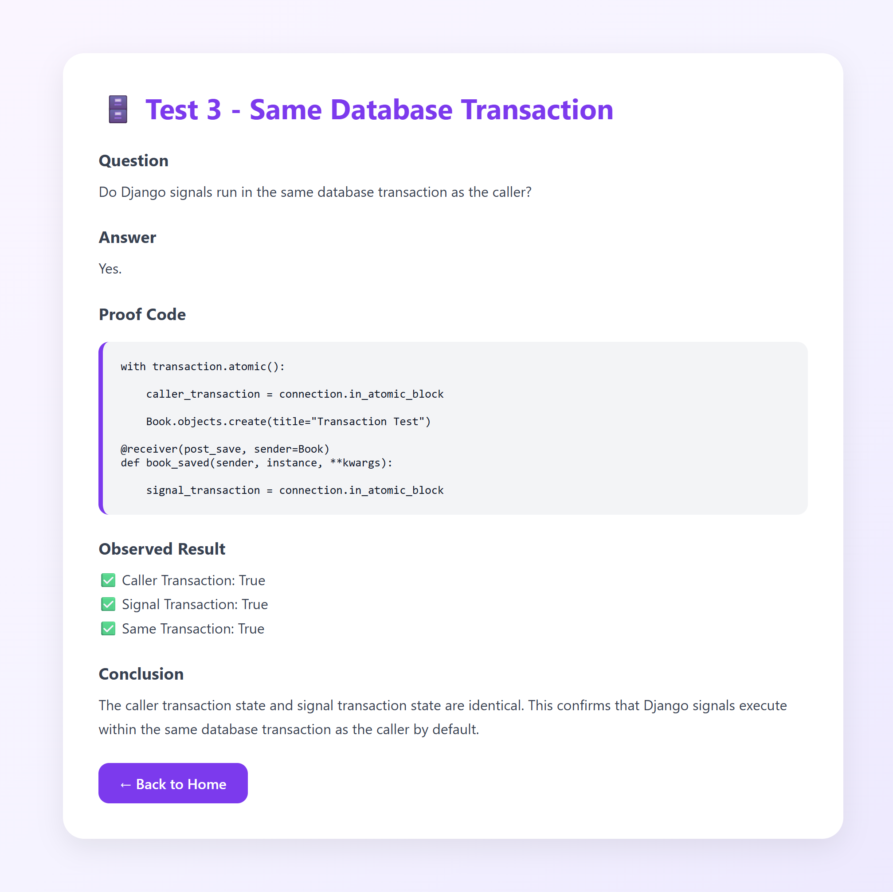

# Django Signals Explorer

An interactive Django project demonstrating the behavior of Django Signals through real-world experiments.

## Overview

This project proves three important characteristics of Django Signals:

### Test 1 — Synchronous Execution
Demonstrates that Django signals execute synchronously by default.

### Test 2 — Same Thread Execution
Shows that signal handlers run in the same thread as the caller.

### Test 3 — Same Database Transaction
Verifies that signals execute within the same database transaction as the triggering operation.

---

## Features

- Interactive UI
- Modern card-based dashboard
- Live signal execution experiment
- Thread verification
- Transaction verification
- Clean Django project structure

---

## Technologies Used

- Python
- Django
- HTML
- CSS
- JavaScript
- SQLite

---

## Project Structure

```text
books/
signal_demo/
Screenshots/
manage.py
requirements.txt
```

## Running the Project

Clone the repository:

```bash
git clone https://github.com/sirajudeenakbar/django-signals-explorer.git
```

Navigate into the project:

```bash
cd django-signals-explorer
```

Install dependencies:

```bash
pip install -r requirements.txt
```

Run migrations:

```bash
python manage.py migrate
```

Start the server:

```bash
python manage.py runserver
```

Open:

```text
http://127.0.0.1:8000/
```

## Screenshots

### Home Page



---

### Test 1 - Synchronous Signals



---

### Test 2 - Same Thread



---

### Test 3 - Same Transaction



## Author

Sirajudeen Akbar